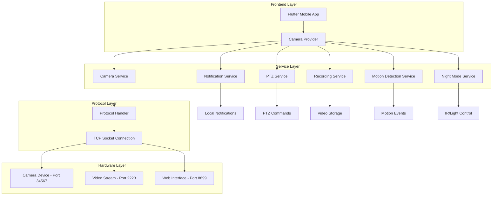
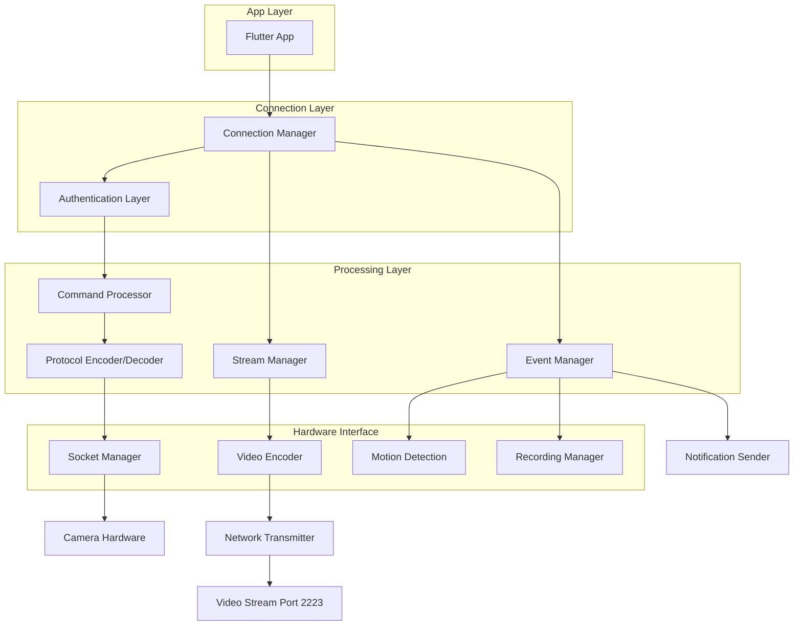
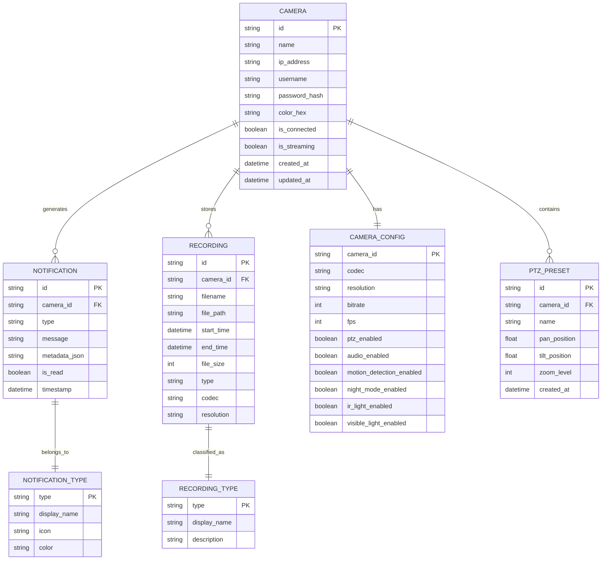

# Documento de Arquitetura Técnica - App de Câmeras

## 1. Arquitetura do Sistema



## 2. Descrição das Tecnologias

- **Frontend**: Flutter 3.16+ com Dart 3.0+
- **State Management**: Provider pattern
- **Networking**: Dart Socket API para TCP
- **Video Player**: video_player plugin com codec fallback
- **Local Storage**: SharedPreferences para configurações
- **Notifications**: flutter_local_notifications
- **UI Components**: Material Design 3

## 3. Definições de Rotas

| Rota | Propósito |
|------|----------|
| / | Tela principal com lista de câmeras e player |
| /settings | Configurações do app e gerenciamento de câmeras |
| /recordings | Lista e reprodução de vídeos gravados |
| /camera-detail/:id | Visualização detalhada de uma câmera específica |
| /add-camera | Assistente para adicionar nova câmera |

## 4. Definições de API

### 4.1 Protocolo de Comunicação Principal

Baseado na análise dos arquivos fornecidos, o sistema utiliza protocolo proprietário sobre TCP:

#### Estrutura do Comando
```
Header (12 bytes):
- Magic Number: 0xFF000000 (4 bytes)
- Command ID: uint32 little-endian (4 bytes) 
- Payload Length: uint32 little-endian (4 bytes)

Payload:
- JSON string com comandos específicos
```

#### Autenticação
```
POST TCP:34567 - Login
```

Request:
| Parâmetro | Tipo | Obrigatório | Descrição |
|-----------|------|-------------|----------|
| EncryptType | string | true | Tipo de criptografia (MD5) |
| LoginType | string | true | Tipo de login (DVRIP-Web) |
| PassWord | string | true | Senha em hash MD5 |
| UserName | string | true | Nome do usuário |

Response:
| Parâmetro | Tipo | Descrição |
|-----------|------|----------|
| Ret | int | Código de retorno (100 = sucesso) |
| SessionID | string | ID da sessão para comandos subsequentes |

Exemplo:
```json
{
  "EncryptType": "MD5",
  "LoginType": "DVRIP-Web", 
  "PassWord": "5d41402abc4b2a76b9719d911017c592",
  "UserName": "admin"
}
```

#### Controle PTZ
```
POST TCP:34567 - PTZ Control
```

Request:
| Parâmetro | Tipo | Obrigatório | Descrição |
|-----------|------|-------------|----------|
| Cmd | string | true | Comando PTZ |
| Channel | int | true | Canal da câmera (0) |
| Action | string | true | Ação (move, zoom, stop) |
| Direction | string | false | Direção do movimento |
| Speed | int | false | Velocidade (1-10) |

Exemplo:
```json
{
  "Cmd": "PTZ",
  "Channel": 0,
  "Action": "move",
  "Direction": "up",
  "Speed": 5
}
```

#### Configuração de Stream
```
POST TCP:34567 - Stream Config
```

Request:
| Parâmetro | Tipo | Obrigatório | Descrição |
|-----------|------|-------------|----------|
| Cmd | string | true | SetStreamConfig |
| Channel | int | true | Canal (0) |
| Codec | string | true | Codec (H.264, H.265, MJPEG) |
| Resolution | string | true | Resolução (1920x1080, 1280x720) |
| Bitrate | int | false | Taxa de bits |
| FPS | int | false | Quadros por segundo |

#### Detecção de Movimento
```
POST TCP:34567 - Motion Detection
```

Request:
| Parâmetro | Tipo | Obrigatório | Descrição |
|-----------|------|-------------|----------|
| Cmd | string | true | SetMotionDetection |
| Channel | int | true | Canal (0) |
| Enable | bool | true | Ativar/desativar |
| Sensitivity | int | false | Sensibilidade (1-10) |
| Areas | array | false | Áreas de detecção |

#### Modo Noturno
```
POST TCP:34567 - Night Mode
```

Request:
| Parâmetro | Tipo | Obrigatório | Descrição |
|-----------|------|-------------|----------|
| Cmd | string | true | SetNightMode |
| Channel | int | true | Canal (0) |
| Mode | string | true | auto, day, night |
| IRLightEnabled | bool | false | Luz IR ativada |
| VisibleLightEnabled | bool | false | Luz visível ativada |

#### Lista de Gravações
```
POST TCP:34567 - Recording List
```

Request:
| Parâmetro | Tipo | Obrigatório | Descrição |
|-----------|------|-------------|----------|
| Cmd | string | true | GetRecordList |
| Channel | int | true | Canal (0) |
| StartTime | string | true | Data/hora início (YYYY-MM-DD HH:mm:ss) |
| EndTime | string | true | Data/hora fim |
| EventType | string | false | Tipo de evento (All, Motion, Alarm) |

Response:
| Parâmetro | Tipo | Descrição |
|-----------|------|----------|
| Ret | int | Código de retorno |
| RecordList | array | Lista de gravações |

### 4.2 Stream de Vídeo

#### Conexão de Stream
```
TCP:2223 - Video Stream
```

O stream de vídeo é transmitido via TCP na porta 2223 usando protocolo proprietário:
- Header de 16 bytes com informações do frame
- Payload com dados do vídeo (H.264/H.265/MJPEG)
- Timestamp e número de sequência para sincronização

## 5. Arquitetura do Servidor (Cliente-Servidor)



## 6. Modelo de Dados

### 6.1 Definição do Modelo de Dados



### 6.2 Linguagem de Definição de Dados (DDL)

#### Tabela de Câmeras
```sql
-- Tabela principal de câmeras
CREATE TABLE cameras (
    id TEXT PRIMARY KEY,
    name TEXT NOT NULL,
    ip_address TEXT NOT NULL,
    username TEXT NOT NULL,
    password_hash TEXT NOT NULL,
    color_hex TEXT DEFAULT '#2196F3',
    is_connected BOOLEAN DEFAULT FALSE,
    is_streaming BOOLEAN DEFAULT FALSE,
    created_at DATETIME DEFAULT CURRENT_TIMESTAMP,
    updated_at DATETIME DEFAULT CURRENT_TIMESTAMP
);

-- Índices para performance
CREATE INDEX idx_cameras_ip ON cameras(ip_address);
CREATE INDEX idx_cameras_name ON cameras(name);
```

#### Configurações da Câmera
```sql
-- Configurações específicas de cada câmera
CREATE TABLE camera_configs (
    camera_id TEXT PRIMARY KEY,
    codec TEXT DEFAULT 'H.264',
    resolution TEXT DEFAULT '1920x1080',
    bitrate INTEGER DEFAULT 2048,
    fps INTEGER DEFAULT 25,
    ptz_enabled BOOLEAN DEFAULT FALSE,
    audio_enabled BOOLEAN DEFAULT TRUE,
    motion_detection_enabled BOOLEAN DEFAULT FALSE,
    night_mode_enabled BOOLEAN DEFAULT FALSE,
    ir_light_enabled BOOLEAN DEFAULT TRUE,
    visible_light_enabled BOOLEAN DEFAULT FALSE,
    motion_sensitivity INTEGER DEFAULT 5,
    night_mode_threshold INTEGER DEFAULT 50,
    FOREIGN KEY (camera_id) REFERENCES cameras(id) ON DELETE CASCADE
);
```

#### Notificações
```sql
-- Tabela de notificações
CREATE TABLE notifications (
    id TEXT PRIMARY KEY,
    camera_id TEXT NOT NULL,
    type TEXT NOT NULL,
    message TEXT NOT NULL,
    metadata_json TEXT,
    is_read BOOLEAN DEFAULT FALSE,
    timestamp DATETIME DEFAULT CURRENT_TIMESTAMP,
    FOREIGN KEY (camera_id) REFERENCES cameras(id) ON DELETE CASCADE
);

-- Índices para consultas eficientes
CREATE INDEX idx_notifications_camera_id ON notifications(camera_id);
CREATE INDEX idx_notifications_timestamp ON notifications(timestamp DESC);
CREATE INDEX idx_notifications_type ON notifications(type);
CREATE INDEX idx_notifications_unread ON notifications(is_read, timestamp DESC);
```

#### Tipos de Notificação
```sql
-- Tipos de notificação suportados
CREATE TABLE notification_types (
    type TEXT PRIMARY KEY,
    display_name TEXT NOT NULL,
    icon TEXT NOT NULL,
    color TEXT NOT NULL
);

-- Dados iniciais
INSERT INTO notification_types (type, display_name, icon, color) VALUES
('motion_detected', 'Movimento Detectado', 'motion_photos_on', '#FF5722'),
('connection_lost', 'Conexão Perdida', 'wifi_off', '#F44336'),
('connection_restored', 'Conexão Restaurada', 'wifi', '#4CAF50'),
('recording_started', 'Gravação Iniciada', 'fiber_manual_record', '#2196F3'),
('recording_stopped', 'Gravação Parada', 'stop', '#9E9E9E'),
('codec_error', 'Erro de Codec', 'error', '#FF9800'),
('authentication_failed', 'Falha na Autenticação', 'lock', '#E91E63'),
('stream_error', 'Erro de Stream', 'videocam_off', '#795548');
```

#### Gravações
```sql
-- Tabela de gravações
CREATE TABLE recordings (
    id TEXT PRIMARY KEY,
    camera_id TEXT NOT NULL,
    filename TEXT NOT NULL,
    file_path TEXT,
    start_time DATETIME NOT NULL,
    end_time DATETIME NOT NULL,
    file_size INTEGER DEFAULT 0,
    type TEXT NOT NULL,
    codec TEXT NOT NULL,
    resolution TEXT NOT NULL,
    created_at DATETIME DEFAULT CURRENT_TIMESTAMP,
    FOREIGN KEY (camera_id) REFERENCES cameras(id) ON DELETE CASCADE
);

-- Índices para busca eficiente
CREATE INDEX idx_recordings_camera_id ON recordings(camera_id);
CREATE INDEX idx_recordings_start_time ON recordings(start_time DESC);
CREATE INDEX idx_recordings_type ON recordings(type);
CREATE INDEX idx_recordings_date_range ON recordings(camera_id, start_time, end_time);
```

#### Tipos de Gravação
```sql
-- Tipos de gravação
CREATE TABLE recording_types (
    type TEXT PRIMARY KEY,
    display_name TEXT NOT NULL,
    description TEXT
);

-- Dados iniciais
INSERT INTO recording_types (type, display_name, description) VALUES
('continuous', 'Contínua', 'Gravação contínua 24/7'),
('motion', 'Movimento', 'Gravação ativada por detecção de movimento'),
('alarm', 'Alarme', 'Gravação ativada por alarme'),
('manual', 'Manual', 'Gravação iniciada manualmente pelo usuário');
```

#### Presets PTZ
```sql
-- Posições pré-definidas para PTZ
CREATE TABLE ptz_presets (
    id TEXT PRIMARY KEY,
    camera_id TEXT NOT NULL,
    name TEXT NOT NULL,
    pan_position REAL NOT NULL,
    tilt_position REAL NOT NULL,
    zoom_level INTEGER NOT NULL,
    created_at DATETIME DEFAULT CURRENT_TIMESTAMP,
    FOREIGN KEY (camera_id) REFERENCES cameras(id) ON DELETE CASCADE
);

-- Índice para busca por câmera
CREATE INDEX idx_ptz_presets_camera_id ON ptz_presets(camera_id);
```

#### Configurações do App
```sql
-- Configurações globais do aplicativo
CREATE TABLE app_settings (
    key TEXT PRIMARY KEY,
    value TEXT NOT NULL,
    updated_at DATETIME DEFAULT CURRENT_TIMESTAMP
);

-- Configurações padrão
INSERT INTO app_settings (key, value) VALUES
('notifications_enabled', 'true'),
('notification_sound', 'true'),
('notification_vibration', 'true'),
('auto_connect_cameras', 'true'),
('stream_quality', 'high'),
('recording_auto_cleanup', 'true'),
('recording_retention_days', '30'),
('dark_theme', 'true'),
('language', 'pt_BR');
```

## 7. Especificações de Implementação

### 7.1 Estrutura de Arquivos Flutter

```
lib/
├── main.dart
├── app.dart
├── core/
│   ├── constants/
│   │   ├── app_constants.dart
│   │   ├── camera_constants.dart
│   │   └── network_constants.dart
│   ├── protocols/
│   │   ├── camera_protocol.dart
│   │   ├── command_builder.dart
│   │   └── response_parser.dart
│   ├── utils/
│   │   ├── codec_utils.dart
│   │   ├── network_utils.dart
│   │   ├── encryption_utils.dart
│   │   └── date_utils.dart
│   └── exceptions/
│       ├── camera_exceptions.dart
│       ├── network_exceptions.dart
│       └── protocol_exceptions.dart
├── data/
│   ├── models/
│   │   ├── camera_model.dart
│   │   ├── notification_model.dart
│   │   ├── recording_model.dart
│   │   ├── ptz_command_model.dart
│   │   └── stream_config_model.dart
│   ├── repositories/
│   │   ├── camera_repository.dart
│   │   ├── notification_repository.dart
│   │   ├── recording_repository.dart
│   │   └── settings_repository.dart
│   └── datasources/
│       ├── local/
│       │   ├── database_helper.dart
│       │   ├── shared_prefs_helper.dart
│       │   └── file_storage_helper.dart
│       └── remote/
│           ├── camera_api.dart
│           ├── socket_client.dart
│           └── stream_client.dart
├── domain/
│   ├── entities/
│   │   ├── camera.dart
│   │   ├── notification.dart
│   │   ├── recording.dart
│   │   └── ptz_preset.dart
│   ├── usecases/
│   │   ├── connect_camera_usecase.dart
│   │   ├── control_ptz_usecase.dart
│   │   ├── manage_notifications_usecase.dart
│   │   └── handle_recordings_usecase.dart
│   └── repositories/
│       ├── camera_repository_interface.dart
│       ├── notification_repository_interface.dart
│       └── recording_repository_interface.dart
├── presentation/
│   ├── providers/
│   │   ├── camera_provider.dart
│   │   ├── notification_provider.dart
│   │   ├── player_provider.dart
│   │   └── settings_provider.dart
│   ├── screens/
│   │   ├── main_screen.dart
│   │   ├── camera_detail_screen.dart
│   │   ├── settings_screen.dart
│   │   ├── recordings_screen.dart
│   │   └── add_camera_screen.dart
│   ├── widgets/
│   │   ├── camera_card/
│   │   │   ├── camera_card.dart
│   │   │   ├── camera_options_menu.dart
│   │   │   └── camera_status_indicator.dart
│   │   ├── player/
│   │   │   ├── video_player_widget.dart
│   │   │   ├── player_controls.dart
│   │   │   ├── codec_error_handler.dart
│   │   │   └── stream_overlay.dart
│   │   ├── controls/
│   │   │   ├── ptz_control_button.dart
│   │   │   ├── audio_control_button.dart
│   │   │   ├── motion_detection_button.dart
│   │   │   ├── night_mode_button.dart
│   │   │   ├── notification_button.dart
│   │   │   └── recordings_button.dart
│   │   ├── notifications/
│   │   │   ├── notification_list.dart
│   │   │   ├── notification_item.dart
│   │   │   ├── camera_notification_badge.dart
│   │   │   └── notification_group.dart
│   │   └── dialogs/
│   │       ├── ptz_control_dialog.dart
│   │       ├── night_mode_dialog.dart
│   │       ├── motion_detection_dialog.dart
│   │       ├── recordings_dialog.dart
│   │       ├── camera_edit_dialog.dart
│   │       └── add_camera_dialog.dart
│   └── theme/
│       ├── app_theme.dart
│       ├── colors.dart
│       └── text_styles.dart
└── services/
    ├── camera_service.dart
    ├── notification_service.dart
    ├── recording_service.dart
    ├── ptz_service.dart
    ├── audio_service.dart
    ├── motion_detection_service.dart
    ├── night_mode_service.dart
    └── stream_service.dart
```

### 7.2 Dependências do Projeto

```yaml
# pubspec.yaml
dependencies:
  flutter:
    sdk: flutter
  
  # State Management
  provider: ^6.1.1
  
  # Networking
  http: ^1.1.0
  
  # Video Player
  video_player: ^2.8.1
  chewie: ^1.7.4
  
  # Local Storage
  shared_preferences: ^2.2.2
  sqflite: ^2.3.0
  path: ^1.8.3
  
  # Notifications
  flutter_local_notifications: ^16.3.0
  
  # UI Components
  material_color_utilities: ^0.5.0
  flutter_colorpicker: ^1.0.3
  
  # Utilities
  crypto: ^3.0.3
  intl: ^0.18.1
  uuid: ^4.2.1
  
  # Permissions
  permission_handler: ^11.1.0
  
  # File Handling
  path_provider: ^2.1.1
  file_picker: ^6.1.1
  
dev_dependencies:
  flutter_test:
    sdk: flutter
  flutter_lints: ^3.0.1
  mockito: ^5.4.4
  build_runner: ^2.4.7
```

### 7.3 Configurações de Build

#### Android (android/app/build.gradle)
```gradle
android {
    compileSdkVersion 34
    
    defaultConfig {
        minSdkVersion 21
        targetSdkVersion 34
        
        // Permissões necessárias
        manifestPlaceholders = [
            'INTERNET': 'android.permission.INTERNET',
            'ACCESS_NETWORK_STATE': 'android.permission.ACCESS_NETWORK_STATE',
            'WAKE_LOCK': 'android.permission.WAKE_LOCK',
            'VIBRATE': 'android.permission.VIBRATE'
        ]
    }
    
    buildTypes {
        release {
            signingConfig signingConfigs.debug
            minifyEnabled true
            proguardFiles getDefaultProguardFile('proguard-android-optimize.txt'), 'proguard-rules.pro'
        }
    }
}
```

#### iOS (ios/Runner/Info.plist)
```xml
<key>NSCameraUsageDescription</key>
<string>Este app precisa acessar a câmera para visualizar streams de vídeo</string>
<key>NSMicrophoneUsageDescription</key>
<string>Este app precisa acessar o microfone para áudio das câmeras</string>
<key>NSLocalNetworkUsageDescription</key>
<string>Este app precisa acessar a rede local para conectar às câmeras</string>
```

## 8. Considerações de Segurança

### 8.1 Criptografia
- Senhas armazenadas com hash SHA-256
- Comunicação com MD5 para compatibilidade com protocolo existente
- Certificados SSL/TLS quando disponível
- Validação de entrada para prevenir injection

### 8.2 Autenticação
- Timeout de sessão configurável
- Retry limitado para tentativas de login
- Bloqueio temporário após falhas consecutivas
- Logout automático em caso de inatividade

### 8.3 Rede
- Validação de endereços IP
- Timeout para conexões TCP
- Verificação de certificados
- Logs de segurança para auditoria

## 9. Monitoramento e Logs

### 9.1 Métricas de Performance
- Latência de conexão
- Taxa de quadros do stream
- Uso de memória e CPU
- Tempo de resposta dos comandos

### 9.2 Logs de Sistema
- Conexões e desconexões
- Comandos enviados e respostas
- Erros de protocolo
- Eventos de notificação

### 9.3 Analytics
- Uso de funcionalidades
- Tipos de câmeras conectadas
- Frequência de comandos PTZ
- Padrões de visualização

Esta arquitetura técnica fornece uma base sólida para implementar todas as funcionalidades solicitadas de forma escalável e maintível.