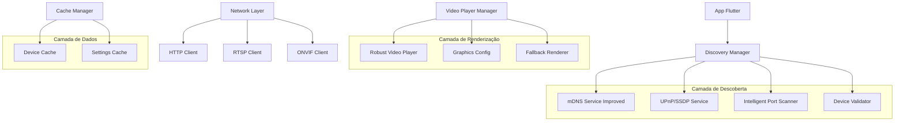
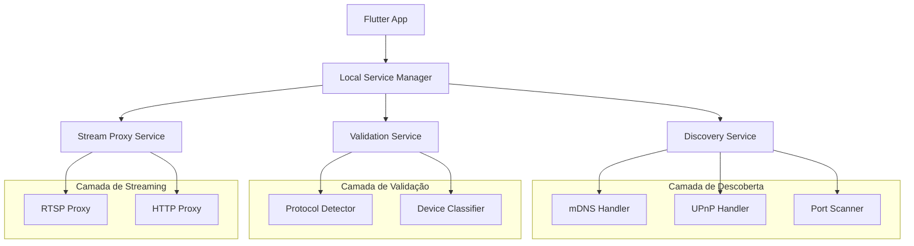
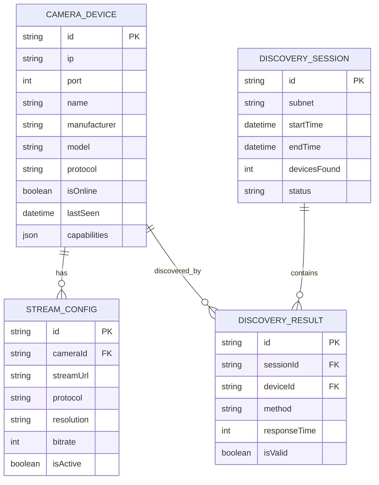

# Arquitetura Técnica - Melhorias do App de Câmeras

## 1. Arquitetura Geral



## 2. Tecnologias e Dependências

### 2.1 Frontend
- **Flutter:** 3.16.0+
- **Dart:** 3.2.0+
- **video_player:** ^2.8.0 (com fallbacks customizados)
- **http:** ^1.1.0
- **shared_preferences:** ^2.2.0

### 2.2 Bibliotecas de Rede
- **multicast_dns:** ^0.3.2 (com implementação customizada)
- **network_info_plus:** ^4.1.0
- **connectivity_plus:** ^5.0.0

### 2.3 Bibliotecas de Sistema
- **device_info_plus:** ^9.1.0
- **permission_handler:** ^11.0.0

## 3. Definições de Rotas

| Rota | Propósito |
|------|----------|
| /discovery | Tela de descoberta de câmeras com progresso em tempo real |
| /camera-list | Lista de câmeras descobertas com status de conexão |
| /camera-view | Visualização de vídeo individual com controles |
| /settings | Configurações de descoberta e portas customizadas |
| /diagnostics | Tela de diagnósticos para troubleshooting |

## 4. APIs e Serviços

### 4.1 Discovery Service API

**Descoberta de dispositivos**
```typescript
POST /api/discovery/start
```

Request:
| Parâmetro | Tipo | Obrigatório | Descrição |
|-----------|------|-------------|----------|
| subnet | string | true | Subnet para scan (ex: 192.168.1.0/24) |
| ports | int[] | false | Lista de portas customizadas |
| timeout | int | false | Timeout em segundos (padrão: 30) |
| aggressive | boolean | false | Scan agressivo (padrão: false) |

Response:
| Parâmetro | Tipo | Descrição |
|-----------|------|----------|
| sessionId | string | ID da sessão de descoberta |
| status | string | Status da descoberta |
| progress | int | Progresso em porcentagem |

Exemplo:
```json
{
  "subnet": "192.168.1.0/24",
  "ports": [554, 8899, 80, 8080],
  "timeout": 30,
  "aggressive": false
}
```

**Validação de dispositivo**
```typescript
POST /api/device/validate
```

Request:
| Parâmetro | Tipo | Obrigatório | Descrição |
|-----------|------|-------------|----------|
| ip | string | true | Endereço IP do dispositivo |
| port | int | true | Porta do dispositivo |
| protocol | string | false | Protocolo esperado (RTSP/HTTP/ONVIF) |

Response:
| Parâmetro | Tipo | Descrição |
|-----------|------|----------|
| isCamera | boolean | Se o dispositivo é uma câmera válida |
| protocols | string[] | Protocolos suportados |
| manufacturer | string | Fabricante detectado |
| model | string | Modelo detectado |

### 4.2 Video Streaming API

**Iniciar stream**
```typescript
POST /api/stream/start
```

Request:
| Parâmetro | Tipo | Obrigatório | Descrição |
|-----------|------|-------------|----------|
| cameraId | string | true | ID único da câmera |
| quality | string | false | Qualidade do stream (low/medium/high) |
| protocol | string | false | Protocolo preferido |

Response:
| Parâmetro | Tipo | Descrição |
|-----------|------|----------|
| streamUrl | string | URL do stream de vídeo |
| protocol | string | Protocolo utilizado |
| resolution | string | Resolução do vídeo |

## 5. Arquitetura do Servidor (Serviços Locais)



## 6. Modelo de Dados

### 6.1 Definição do Modelo de Dados



### 6.2 Definições DDL

**Tabela de Dispositivos de Câmera**
```sql
CREATE TABLE camera_devices (
    id TEXT PRIMARY KEY,
    ip TEXT NOT NULL,
    port INTEGER NOT NULL,
    name TEXT,
    manufacturer TEXT,
    model TEXT,
    protocol TEXT,
    is_online BOOLEAN DEFAULT false,
    last_seen TIMESTAMP DEFAULT CURRENT_TIMESTAMP,
    capabilities TEXT, -- JSON
    created_at TIMESTAMP DEFAULT CURRENT_TIMESTAMP,
    updated_at TIMESTAMP DEFAULT CURRENT_TIMESTAMP
);

CREATE INDEX idx_camera_devices_ip ON camera_devices(ip);
CREATE INDEX idx_camera_devices_last_seen ON camera_devices(last_seen DESC);
CREATE INDEX idx_camera_devices_online ON camera_devices(is_online);
```

**Tabela de Configurações de Stream**
```sql
CREATE TABLE stream_configs (
    id TEXT PRIMARY KEY,
    camera_id TEXT NOT NULL,
    stream_url TEXT NOT NULL,
    protocol TEXT NOT NULL,
    resolution TEXT,
    bitrate INTEGER,
    is_active BOOLEAN DEFAULT false,
    created_at TIMESTAMP DEFAULT CURRENT_TIMESTAMP,
    FOREIGN KEY (camera_id) REFERENCES camera_devices(id)
);

CREATE INDEX idx_stream_configs_camera_id ON stream_configs(camera_id);
CREATE INDEX idx_stream_configs_active ON stream_configs(is_active);
```

**Tabela de Sessões de Descoberta**
```sql
CREATE TABLE discovery_sessions (
    id TEXT PRIMARY KEY,
    subnet TEXT NOT NULL,
    start_time TIMESTAMP DEFAULT CURRENT_TIMESTAMP,
    end_time TIMESTAMP,
    devices_found INTEGER DEFAULT 0,
    status TEXT DEFAULT 'running'
);

CREATE INDEX idx_discovery_sessions_start_time ON discovery_sessions(start_time DESC);
```

**Tabela de Resultados de Descoberta**
```sql
CREATE TABLE discovery_results (
    id TEXT PRIMARY KEY,
    session_id TEXT NOT NULL,
    device_id TEXT,
    ip TEXT NOT NULL,
    port INTEGER NOT NULL,
    method TEXT NOT NULL, -- 'mdns', 'upnp', 'port_scan'
    response_time INTEGER,
    is_valid BOOLEAN DEFAULT false,
    error_message TEXT,
    created_at TIMESTAMP DEFAULT CURRENT_TIMESTAMP,
    FOREIGN KEY (session_id) REFERENCES discovery_sessions(id),
    FOREIGN KEY (device_id) REFERENCES camera_devices(id)
);

CREATE INDEX idx_discovery_results_session_id ON discovery_results(session_id);
CREATE INDEX idx_discovery_results_ip ON discovery_results(ip);
```

**Dados Iniciais**
```sql
-- Configurações padrão do sistema
INSERT INTO system_settings (key, value) VALUES
('default_scan_timeout', '30'),
('max_concurrent_scans', '50'),
('cache_expiry_hours', '24'),
('enable_aggressive_scan', 'false');

-- Portas comuns por fabricante
INSERT INTO manufacturer_ports (manufacturer, ports) VALUES
('hikvision', '[8000, 554, 80]'),
('dahua', '[37777, 554, 80]'),
('axis', '[80, 554, 8080]'),
('foscam', '[88, 554, 8080]'),
('generic', '[80, 554, 8080, 8899]');
```

## 7. Configurações de Performance

### 7.1 Otimizações de Descoberta
- **Scan Paralelo:** Máximo 20 threads simultâneas
- **Timeout Adaptativo:** 3s para portas comuns, 10s para scan completo
- **Cache Inteligente:** TTL de 24 horas para dispositivos válidos
- **Priorização:** RTSP > ONVIF > HTTP > Proprietário

### 7.2 Otimizações de Renderização
- **Buffer Adaptativo:** 2-8MB baseado na capacidade do dispositivo
- **Fallback Automático:** Detecção de falhas gráficas em tempo real
- **Compressão Inteligente:** Ajuste automático de qualidade

### 7.3 Configurações de Rede
- **Connection Pool:** Máximo 10 conexões simultâneas
- **Retry Logic:** 3 tentativas com backoff exponencial
- **Timeout Escalonado:** 5s/10s/15s para tentativas sucessivas