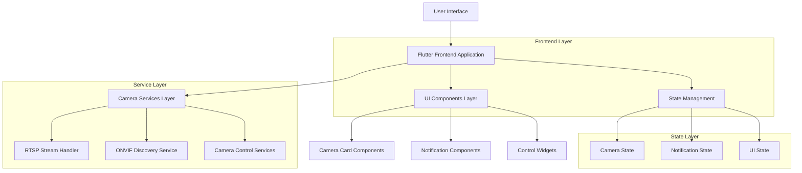
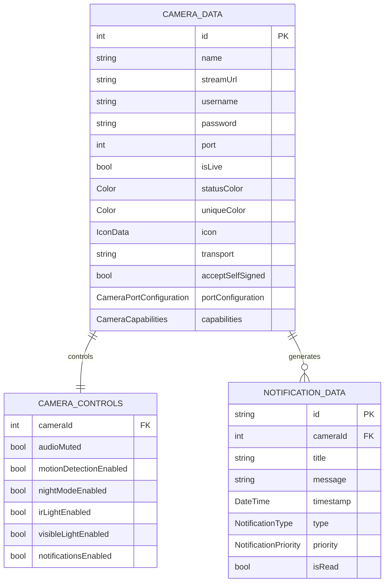

# Documento de Arquitetura Técnica - Redesign do App de Câmeras

## 1. Design da Arquitetura



## 2. Descrição das Tecnologias

* Frontend: <Flutter@3.x> + <Dart@3.x>

* State Management: Provider pattern (já implementado)

* Video Player: video\_player package + fvp para RTSP

* Storage: SharedPreferences para persistência local

* Network: http package para comunicação ONVIF

## 3. Definições de Rotas

| Rota      | Propósito                                                   |
| --------- | ----------------------------------------------------------- |
| /         | Página de Câmeras (nova tela inicial, substitui MainScreen) |
| /access   | Página de Controle de Acesso                                |
| /settings | Página de Configurações                                     |

## 4. Definições da API

### 4.1 APIs Principais

**Gerenciamento de Câmeras**

```dart
// CameraService - métodos existentes mantidos
Future<void> addCamera(CameraData camera)
Future<void> updateCamera(CameraData camera)
Future<void> removeCamera(int cameraId)
Future<List<CameraData>> getCameras()
```

**Controles de Câmera**

```dart
// Novos métodos para controles
Future<void> togglePTZ(int cameraId, String direction)
Future<void> toggleAudio(int cameraId, bool mute)
Future<void> toggleMotionDetection(int cameraId, bool enabled)
Future<void> toggleNightMode(int cameraId, bool enabled)
Future<void> toggleIRLight(int cameraId, bool enabled)
Future<void> toggleVisibleLight(int cameraId, bool enabled)
Future<void> toggleNotifications(int cameraId, bool enabled)
Future<List<Recording>> getRecordings(int cameraId)
```

**Descoberta ONVIF**

```dart
// OnvifDiscoveryService - métodos existentes
Future<List<OnvifDevice>> scanDevices()
Future<void> connectToDevice(String ip, String username, String password)
```

## 5. Arquitetura do Servidor

Não aplicável - aplicação frontend apenas.

## 6. Modelo de Dados

### 6.1 Definição do Modelo de Dados



### 6.2 Linguagem de Definição de Dados

**Modelo de Controles de Câmera (Novo)**

```dart
class CameraControls {
  final int cameraId;
  bool audioMuted;
  bool motionDetectionEnabled;
  bool nightModeEnabled;
  bool irLightEnabled;
  bool visibleLightEnabled;
  bool notificationsEnabled;
  
  CameraControls({
    required this.cameraId,
    this.audioMuted = false,
    this.motionDetectionEnabled = true,
    this.nightModeEnabled = false,
    this.irLightEnabled = false,
    this.visibleLightEnabled = false,
    this.notificationsEnabled = true,
  });
  
  Map<String, dynamic> toJson() => {
    'cameraId': cameraId,
    'audioMuted': audioMuted,
    'motionDetectionEnabled': motionDetectionEnabled,
    'nightModeEnabled': nightModeEnabled,
    'irLightEnabled': irLightEnabled,
    'visibleLightEnabled': visibleLightEnabled,
    'notificationsEnabled': notificationsEnabled,
  };
  
  factory CameraControls.fromJson(Map<String, dynamic> json) => CameraControls(
    cameraId: json['cameraId'],
    audioMuted: json['audioMuted'] ?? false,
    motionDetectionEnabled: json['motionDetectionEnabled'] ?? true,
    nightModeEnabled: json['nightModeEnabled'] ?? false,
    irLightEnabled: json['irLightEnabled'] ?? false,
    visibleLightEnabled: json['visibleLightEnabled'] ?? false,
    notificationsEnabled: json['notificationsEnabled'] ?? true,
  );
}
```

**Modelo de Notificação Aprimorado**

```dart
class CameraNotificationEnhanced extends CameraNotification {
  final Color cameraColor;
  final String cameraName;
  
  CameraNotificationEnhanced({
    required super.id,
    required super.title,
    required super.message,
    required super.timestamp,
    required super.type,
    required super.priority,
    super.cameraId,
    super.isRead = false,
    required this.cameraColor,
    required this.cameraName,
  });
}
```

**Estrutura de Componentes Principais**

```dart
// Novo widget para controles de câmera
class CameraControlsBar extends StatelessWidget {
  final CameraData camera;
  final CameraControls controls;
  final Function(String) onControlTap;
  
  const CameraControlsBar({
    required this.camera,
    required this.controls,
    required this.onControlTap,
  });
}

// Widget aprimorado para card de câmera
class EnhancedCameraCard extends StatelessWidget {
  final CameraData camera;
  final CameraControls controls;
  final VoidCallback onMenuTap;
  final Function(String) onControlTap;
  
  const EnhancedCameraCard({
    required this.camera,
    required this.controls,
    required this.onMenuTap,
    required this.onControlTap,
  });
}

// Widget para painel de notificações aprimorado
class EnhancedNotificationPanel extends StatelessWidget {
  final List<CameraNotificationEnhanced> notifications;
  final Function(CameraNotificationEnhanced) onNotificationTap;
  final Function(String) onNotificationDismiss;
  
  const EnhancedNotificationPanel({
    required this.notifications,
    required this.onNotificationTap,
    required this.onNotificationDismiss,
  });
}
```

**Modificações na Navegação Principal**

```dart
// Atualização do AppMainScreen
class AppMainScreen extends StatefulWidget {
  @override
  State<AppMainScreen> createState() => _AppMainScreenState();
}

class _AppMainScreenState extends State<AppMainScreen> {
  int _selectedIndex = 0; // Inicia na página de câmeras
  
  final List<Widget> _screens = const [
    DevicesAndCamerasScreen(), // Nova tela inicial
    AccessControlScreen(),
    SettingsScreen(),
  ];
  
  @override
  Widget build(BuildContext context) {
    return Scaffold(
      body: IndexedStack(
        index: _selectedIndex,
        children: _screens,
      ),
      bottomNavigationBar: BottomNavigationBar(
        currentIndex: _selectedIndex,
        type: BottomNavigationBarType.fixed,
        onTap: (index) => setState(() => _selectedIndex = index),
        items: const [
          BottomNavigationBarItem(
            icon: Icon(Icons.camera_alt),
            label: 'Câmeras',
          ),
          BottomNavigationBarItem(
            icon: Icon(Icons.security),
            label: 'Acesso',
          ),
          BottomNavigationBarItem(
            icon: Icon(Icons.settings),
            label: 'Configurações',
          ),
        ],
      ),
    );
  }
}
```

