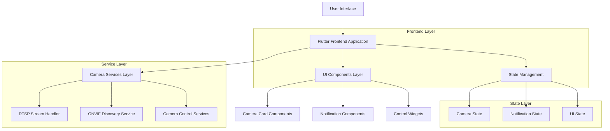

# Documento de Arquitetura Técnica - Redesign do App de Câmeras

## 1. Design da Arquitetura



## 2. Descrição das Tecnologias

* Frontend: <Flutter@3.x> + <Dart@3.x>

* State Management: Provider pattern (já implementado)

* Video Player: video\_player package + fvp para RTSP

* Storage: SharedPreferences para persistência local

* Network: http package para comunicação ONVIF

## 3. Definições de Rotas

| Rota      | Propósito                                                   |
| --------- | ----------------------------------------------------------- |
| /         | Página de Câmeras (nova tela inicial, substitui MainScreen) |
| /access   | Página de Controle de Acesso                                |
| /settings | Página de Configurações                                     |

## 4. Definições da API

### 4.1 APIs Principais

**Gerenciamento de Câmeras**

```dart
// CameraService - métodos existentes mantidos
Future<void> addCamera(CameraData camera)
Future<void> updateCamera(CameraData camera)
Future<void> removeCamera(int cameraId)
Future<List<CameraData>> getCameras()
```

**Controles de Câmera**

```dart
// Novos métodos para controles
Future<void> togglePTZ(int cameraId, String direction)
Future<void> toggleAudio(int cameraId, bool mute)
Future<void> toggleMotionDetection(int cameraId, bool enabled)
Future<void> toggleNightMode(int cameraId, bool enabled)
Future<void> toggleIRLight(int cameraId, bool enabled)
Future<void> toggleVisibleLight(int cameraId, bool enabled)
Future<void> toggleNotifications(int cameraId, bool enabled)
Future<List<Recording>> getRecordings(int cameraId)
```

**Descoberta ONVIF**

```dart
// OnvifDiscoveryService - métodos existentes
Future<List<OnvifDevice>> scanDevices()
Future<void> connectToDevice(String ip, String username, String password)
```

## 5. Arquitetura do Servidor

Não aplicável - aplicação frontend apenas.

## 6. Modelo de Dados

### 6.1 Definição do Modelo de Dados

```mermaid
erDiagram
    CAMERA_DATA {
        int id PK
        string name
        string streamUrl
        string username
        string password
        int port
        bool isLive
        Color statusColor
        Color uniqueColor
        IconData icon
        string transport
        bool acceptSelf
```

