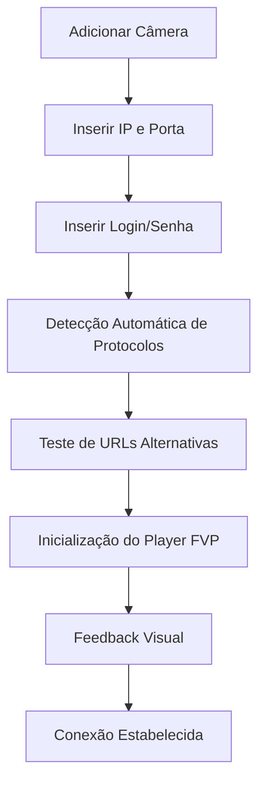

# Revisão do Sistema de Conexão com Câmeras

## 1. Visão Geral do Projeto

Este documento descreve a revisão completa do sistema de conexão com câmeras do aplicativo, focando na melhoria da experiência do usuário, robustez das conexões e correção de problemas identificados.

## 2. Funcionalidades Principais

### 2.1 Papéis de Usuário

| Papel | Método de Registro | Permissões Principais |
|-------|-------------------|----------------------|
| Usuário Final | Acesso direto ao app | Pode adicionar câmeras, configurar credenciais, visualizar streams |

### 2.2 Funcionalidades Técnicas Implementadas

O sistema de conexão com câmeras implementa as seguintes funcionalidades técnicas:

1. **Player FVP Otimizado**: Player FVP configurado especificamente para streams RTSP com fallback automático para Video Player nativo
2. **URLs Alternativas**: Sistema que testa automaticamente múltiplas URLs de conexão e portas alternativas (554, 8000, 8899)
3. **Sistema de Autenticação**: Campos diretos e sempre visíveis para usuário e senha, sem toggle ou condicionais
4. **Reconexão Automática**: Sistema automático de reconexão com feedback visual e notificações ao usuário
5. **Logs Detalhados**: Sistema de logging integrado para diagnóstico rápido de problemas
6. **Feedback Visual**: Indicadores de status, progress bars e mensagens detalhadas durante conexões

## 3. Processo Principal

### Fluxo do Usuário
1. Usuário adiciona nova câmera inserindo IP e porta
2. Insere credenciais nos campos diretos de usuário e senha
3. Sistema detecta automaticamente protocolos suportados
4. Sistema testa múltiplas URLs de conexão automaticamente
5. Exibe feedback visual durante processo de conexão
6. Notifica sobre sucesso ou falha da conexão
7. Em caso de falha, exibe logs detalhados para diagnóstico



## 4. Design da Interface do Usuário

### 4.1 Estilo de Design

- **Cores Primárias**: Azul (#2196F3) para elementos principais, Verde (#4CAF50) para status online
- **Cores Secundárias**: Laranja (#FF9800) para avisos, Vermelho (#F44336) para erros
- **Estilo de Botões**: Material Design com cantos arredondados (8px)
- **Fontes**: Roboto 14px para texto normal, Roboto Medium 16px para títulos
- **Layout**: Card-based com navegação simples
- **Ícones**: Material Icons com estilo outlined para melhor visibilidade

### 4.2 Elementos Visuais

- **Interface de Credenciais**: Campos de texto diretos para usuário e senha sempre visíveis, botão "Conectar"
- **Feedback Visual**: Progress bars animados, indicadores de status coloridos, mensagens de estado

### 4.3 Responsividade

O sistema é projetado mobile-first com adaptação para desktop. Inclui otimização para interação touch em dispositivos móveis.

## 5. Problemas Identificados e Soluções

### 5.1 Inconsistência na Descoberta de Câmeras

**Problema**: Variação entre 0 dispositivos detectados e detecção nas portas 554 e 8899

**Solução**:
- Implementar descoberta sequencial em múltiplas portas
- Adicionar cache de descoberta para evitar re-escaneamento desnecessário
- Melhorar algoritmo de detecção com timeouts configuráveis

### 5.2 Problemas com Player FVP para Streams RTSP

**Problema**: Falhas na inicialização e reprodução de streams RTSP

**Solução**:
- Configurar FVP com parâmetros otimizados para RTSP
- Implementar fallback para Video Player nativo
- Adicionar detecção automática do melhor player para cada tipo de stream
- Melhorar tratamento de erros específicos do FVP

### 5.3 Problemas na Inicialização do Player

**Problema**: Timeouts e falhas durante inicialização

**Solução**:
- Implementar sistema de retry com backoff exponencial
- Adicionar pré-validação de URLs antes da inicialização
- Melhorar logs de diagnóstico para identificar causas específicas
- Implementar health check contínuo das conexões

## 6. Especificações Técnicas

### 6.1 URLs Alternativas

```dart
class AlternativeUrlGenerator {
  static List<String> generateRtspUrls(String ip, int port) {
    return [
      'rtsp://$ip:$port/stream1',
      'rtsp://$ip:$port/stream0',
      'rtsp://$ip:$port/live',
      'rtsp://$ip:$port/h264',
      'rtsp://$ip:$port/cam/realmonitor?channel=1&subtype=0'
    ];
  }
}
```

### 6.2 Sistema de Logs

```dart
class DetailedLoggingService {
  void logPlayerInitialization(String cameraId, String status) {
    final timestamp = DateTime.now().toIso8601String();
    print('[timestamp] Player Init - Camera: cameraId, Status: status');
  }
}
```

## 7. Melhorias de Performance

- **Cache de Descoberta**: Armazenar resultados de descoberta por 5 minutos
- **Conexões Paralelas**: Testar múltiplas URLs simultaneamente
- **Lazy Loading**: Carregar players apenas quando necessário
- **Memory Management**: Liberar recursos de players inativos

## 8. Testes e Validação

### 8.1 Testes de Conectividade
- Teste com diferentes marcas de câmeras IP
- Validação de protocolos ONVIF e RTSP
- Teste de reconexão automática
- Validação de performance com múltiplas câmeras

### 8.2 Testes de Interface
- Validação de responsividade em diferentes tamanhos de tela
- Teste de usabilidade para configuração de credenciais
- Validação de feedback visual durante conexões

## 9. Considerações de Segurança

- Armazenamento seguro de credenciais usando encrypted shared preferences
- Validação de entrada para prevenir ataques de injeção
- Timeout adequado para prevenir ataques de DoS
- Logs sem exposição de informações sensíveis