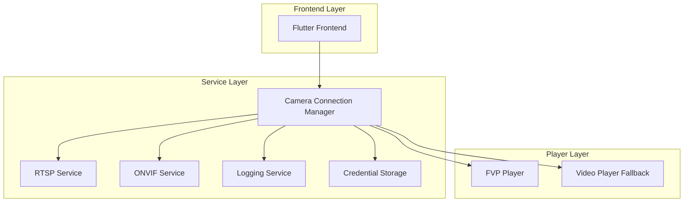
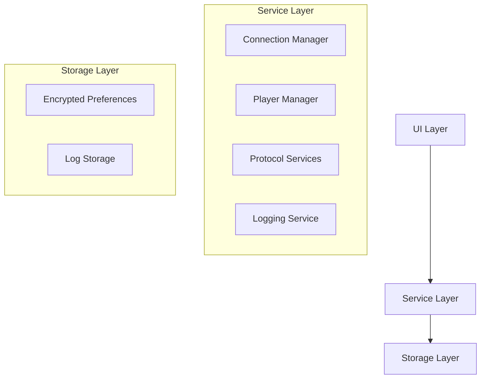
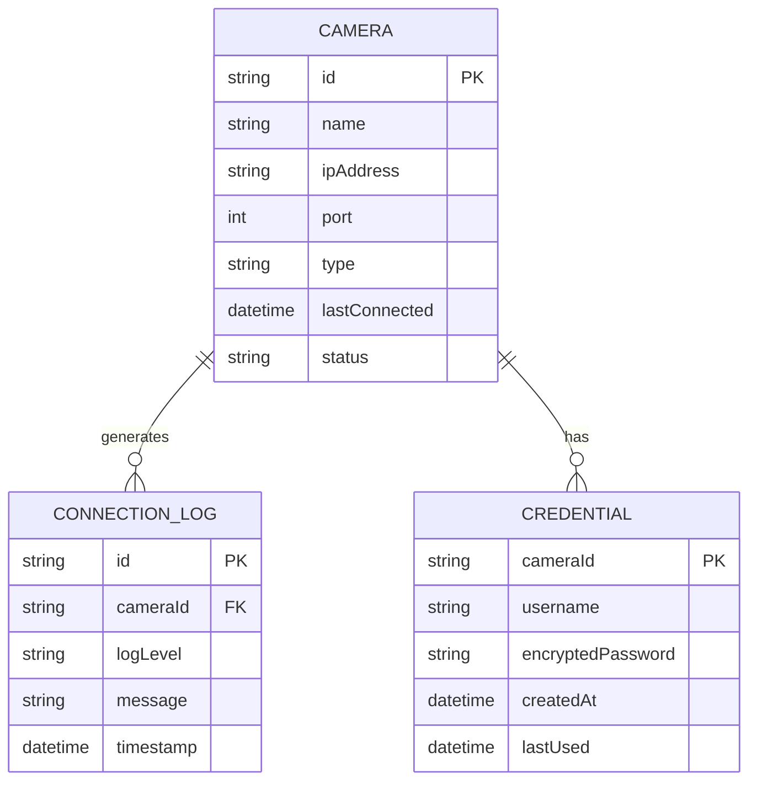

# Arquitetura Técnica - Sistema de Conexão com Câmeras

## 1. Arquitetura do Sistema



## 2. Descrição das Tecnologias

- **Frontend**: Flutter 3.32.8 + Dart 3.8.1
- **Video Players**: FVP (Flutter Video Player) + Video Player nativo como fallback
- **Protocolos**: ONVIF, RTSP
- **Storage**: SharedPreferences (encrypted) para credenciais
- **Logging**: Sistema integrado com múltiplos níveis
- **State Management**: Provider para gerenciamento de estado

### 2.1 Inicialização Crítica do FVP Player

⚠️ **IMPORTANTE**: O plugin FVP deve ser registrado antes de qualquer uso do VideoPlayerController.

```dart
import 'package:fvp/fvp.dart' as fvp;

// OBRIGATÓRIO: Chamar antes de criar qualquer VideoPlayerController
fvp.registerWith();
```

**Consequências da não inicialização:**
- Falhas na inicialização do player de vídeo
- Streams RTSP podem não funcionar corretamente
- Erros de reprodução intermitentes
- Performance degradada do player

**Localização no código:**
- `video_player_widget.dart` (linha 81): `fvp.registerWith();`
- `live_stream_player.dart` (linha 68): `registerWith(options: {...});`

**Ordem de inicialização recomendada:**
1. Registrar FVP plugin (`fvp.registerWith()`)
2. Inicializar LoggingService
3. Criar VideoPlayerController
4. Configurar listeners e callbacks

## 3. Funcionalidades Técnicas

O sistema implementa as seguintes funcionalidades técnicas principais:

- **Player FVP Otimizado**: Configuração específica para streams RTSP com fallback automático
- **URLs Alternativas**: Teste automático de múltiplas URLs e portas
- **Sistema de Autenticação**: Campos diretos para credenciais sem toggle
- **Reconexão Automática**: Sistema de retry com feedback visual
- **Logs Detalhados**: Sistema integrado de logging para diagnóstico
- **Feedback Visual**: Indicadores de status em tempo real

## 4. Definições de API (Serviços Internos)

### 4.1 Core Services

**Camera Connection Manager**
```dart
class CameraConnectionManager {
  Future<ConnectionResult> connectWithFallback(CameraModel camera);
  Future<void> testMultipleUrls(List<String> urls);
  Stream<ConnectionStatus> getConnectionStatusStream(String cameraId);
  Future<void> reconnectAutomatically(String cameraId);
}
```

**Credential Storage Service**
```dart
class CredentialStorageService {
  Future<void> saveCredentials(String cameraId, String username, String password);
  Future<Credentials?> getCredentials(String cameraId);
  Future<void> removeCredentials(String cameraId);
}
```

### 4.2 Player Management

**Stream Player Manager**
```dart
class StreamPlayerManager {
  Future<PlayerType> selectOptimalPlayer(String streamUrl);
  Future<void> initializePlayerWithLogs(String cameraId, String streamUrl);
  Stream<PlayerStatus> getPlayerStatusStream(String cameraId);
  Future<void> handlePlayerError(String cameraId, PlayerError error);
}
```

### 4.3 Protocol Services

**RTSP Service**
```dart
class RTSPService {
  List<String> generateAlternativeUrls(String ip, int port);
  Future<bool> testConnection(String url, Credentials? credentials);
}
```

**ONVIF Service**
```dart
class ONVIFService {
  Future<List<String>> discoverCameras();
  Future<String> getStreamUrl(String deviceUrl, Credentials credentials);
}
```

### 4.4 Logging Service

**Integrated Logging Service**
```dart
class IntegratedLoggingService {
  void logConnectionAttempt(String cameraId, String url, String protocol);
  void logPlayerInitialization(String cameraId, PlayerType player, String status);
  void logReconnectionAttempt(String cameraId, int attemptNumber);
  List<LogEntry> getLogsForCamera(String cameraId);
}
```

## 5. Arquitetura do Sistema (Camadas)



## 6. Modelo de Dados

### 6.1 Definição do Modelo de Dados



### 6.2 Data Definition Language

**Camera Model**
```dart
class CameraModel {
  final String id;
  final String name;
  final String ipAddress;
  final int port;
  final String type;
  final DateTime? lastConnected;
  final ConnectionStatus status;
  
  CameraModel({
    required this.id,
    required this.name,
    required this.ipAddress,
    required this.port,
    required this.type,
    this.lastConnected,
    required this.status,
  });
}
```

**Credentials Model**
```dart
class Credentials {
  final String username;
  final String password;
  
  Credentials({
    required this.username,
    required this.password,
  });
}
```

**Connection Log Model**
```dart
class ConnectionLog {
  final String id;
  final String cameraId;
  final LogLevel level;
  final String message;
  final DateTime timestamp;
  
  ConnectionLog({
    required this.id,
    required this.cameraId,
    required this.level,
    required this.message,
    required this.timestamp,
  });
}
```

## 7. Implementações Técnicas Principais

### 7.1 Player FVP para RTSP
- Configuração otimizada do FVP para streams RTSP
- Fallback automático para Video Player nativo em caso de falha
- Tratamento específico de erros do FVP

### 7.2 URLs Alternativas e Fallback
- Geração automática de múltiplas URLs de teste
- Teste sequencial de portas alternativas (554, 8000, 8899)
- Sistema de cache para URLs funcionais

### 7.3 Sistema de Autenticação
- Campos diretos para usuário e senha
- Armazenamento seguro com encrypted SharedPreferences
- Integração automática com URLs RTSP autenticadas

### 7.4 Logs Detalhados
- Sistema de logging para diagnóstico
- Captura de erros específicos de inicialização
- Logs de tentativas de reconexão

### 7.5 Reconexão Automática
- Sistema de retry com backoff exponencial
- Notificações visuais durante tentativas
- Health check contínuo das conexões

### 7.6 Feedback Visual ao Usuário
- Indicadores de status em tempo real
- Progress bars durante conexão
- Mensagens detalhadas de erro
- Contadores de tentativas de reconexão

## 8. Configurações de Segurança

- **Credenciais**: Armazenamento criptografado usando encrypted_shared_preferences
- **Validação**: Sanitização de entradas para prevenir injeção
- **Timeouts**: Configuração adequada para prevenir ataques DoS
- **Logs**: Exclusão de informações sensíveis dos logs