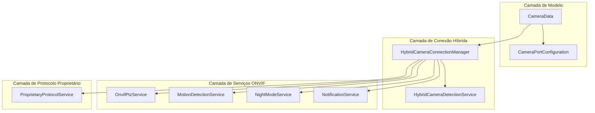
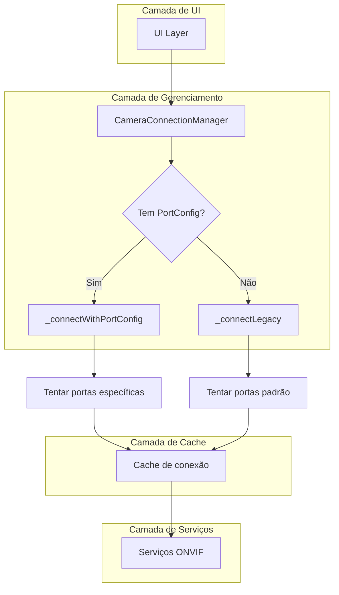
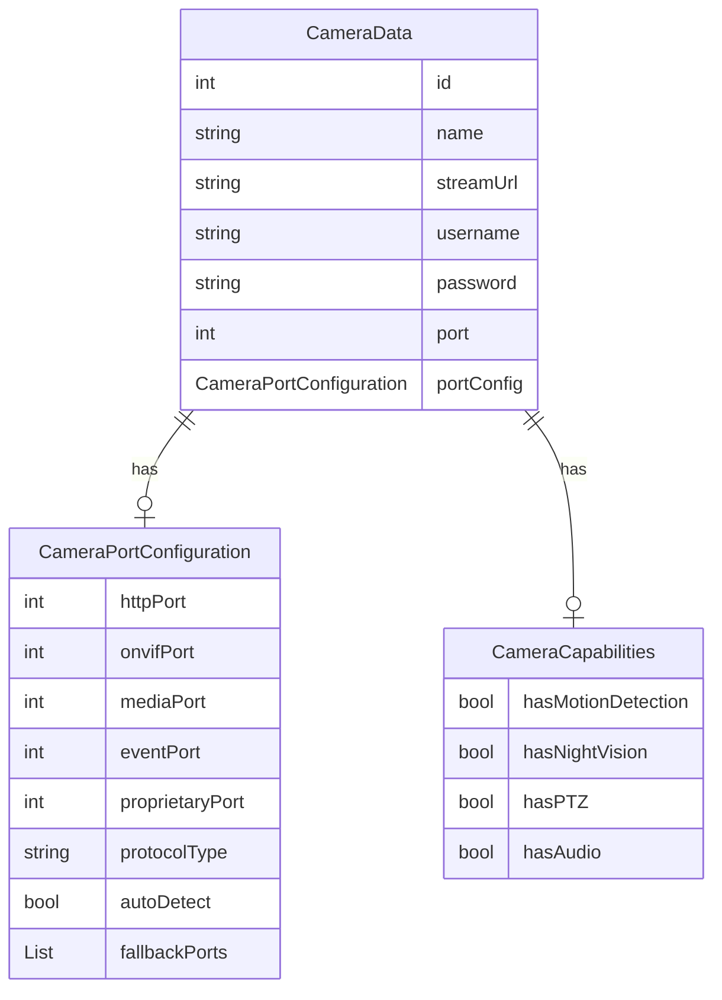
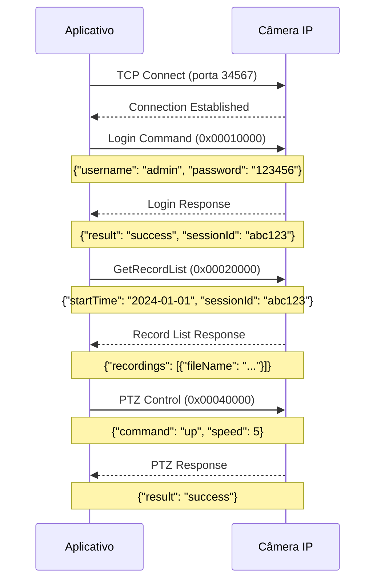
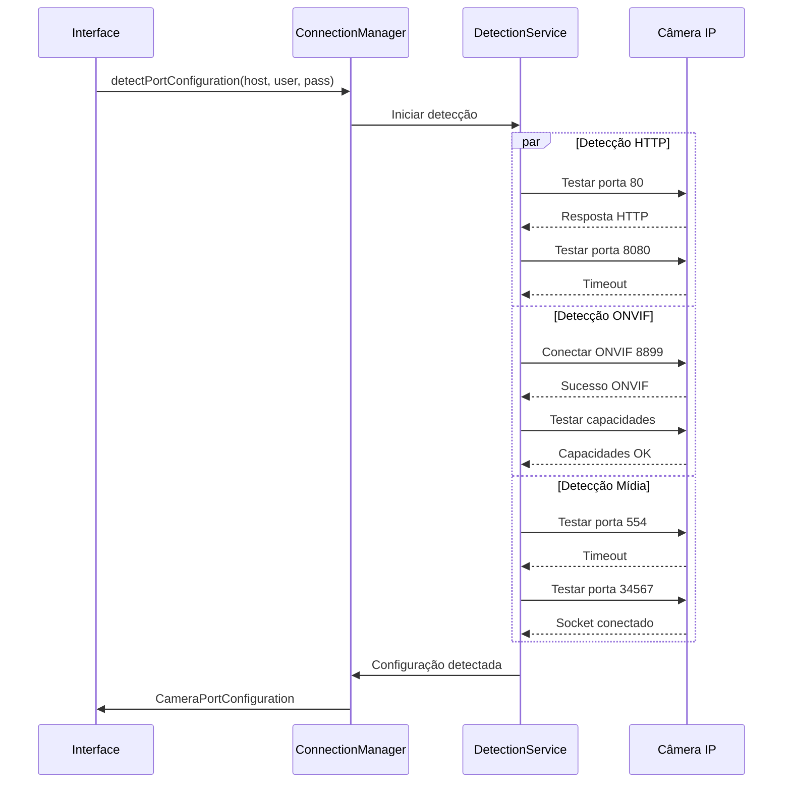

# Arquitetura Técnica - Suporte a Múltiplas Portas

## 1. Arquitetura do Sistema



## 2. Descrição das Tecnologias

- **Frontend**: Flutter/Dart (existente)
- **Networking**: Socket, HTTP, easy_onvif package
- **Protocolo Proprietário**: TCP Socket binário + JSON payload
- **Persistência**: SharedPreferences (JSON serialization)
- **Detecção**: Port scanning com timeout + protocol detection

## 3. Definições de Rotas

Não há novas rotas, apenas extensão das telas existentes:

| Tela | Modificação | Propósito |
|------|-------------|----------|
| Adicionar Câmera | Botão "Configuração Avançada" | Acesso à configuração de portas |
| Editar Câmera | Seção "Portas" | Modificar configuração existente |
| Detalhes da Câmera | Indicador de portas | Mostrar configuração ativa |

## 4. APIs dos Novos Serviços

### 4.1 HybridCameraDetectionService

**Detecção automática de protocolos**
```dart
Future<CameraPortConfiguration?> detectOptimalProtocol(
  String host, 
  String username, 
  String password
)
```

**Detecção de capacidades ONVIF**
```dart
Future<OnvifDetectionResult?> _detectOnvifCapabilities(
  String host, String username, String password
)
```

**Detecção de protocolo proprietário**
```dart
Future<ProprietaryDetectionResult?> _detectProprietaryProtocol(
  String host, String username, String password
)
```

Parâmetros:
| Nome | Tipo | Obrigatório | Descrição |
|------|------|-------------|----------|
| host | String | true | IP ou hostname da câmera |
| username | String | true | Usuário ONVIF |
| password | String | true | Senha ONVIF |

Retorno:
| Campo | Tipo | Descrição |
|-------|------|----------|
| httpPort | int? | Porta HTTP detectada |
| onvifPort | int? | Porta ONVIF detectada |
| mediaPort | int? | Porta de mídia detectada |

**Detecção de porta HTTP**
```dart
Future<int?> _detectHttpPort(String host)
```

**Detecção de porta ONVIF**
```dart
Future<int?> _detectOnvifPort(String host, String user, String pass)
```

**Detecção de porta de mídia**
```dart
Future<int?> _detectMediaPort(String host)
```

### 4.2 ProprietaryProtocolService

**Conexão com protocolo proprietário**
```dart
Future<bool> connect(String host, int port, String username, String password)
```

Parâmetros:
| Nome | Tipo | Obrigatório | Descrição |
|------|------|-------------|----------|
| host | String | true | IP da câmera |
| port | int | true | Porta do protocolo (34567) |
| username | String | true | Usuário |
| password | String | true | Senha |

**Listagem de gravações**
```dart
Future<List<RecordingInfo>?> getRecordList({
  int channel = 0,
  required DateTime startTime,
  required DateTime endTime,
  String recordType = 'all',
})
```

**Controle PTZ proprietário**
```dart
Future<bool> ptzControl({
  int channel = 0,
  required String command,
  int speed = 5,
  int duration = 1000,
})
```

**Reprodução de gravação**
```dart
Future<String?> startPlayback({
  int channel = 0,
  required String fileName,
  required DateTime startTime,
  String streamType = 'main',
})
```

### 4.3 HybridCameraConnectionManager

**Conexão unificada**
```dart
static Future<Onvif?> connectToCamera(CameraData camera)
```

Parâmetros:
| Nome | Tipo | Obrigatório | Descrição |
|------|------|-------------|----------|
| camera | CameraData | true | Dados da câmera com configuração |

Retorno:
| Tipo | Descrição |
|------|----------|
| Onvif? | Conexão ONVIF estabelecida ou null |

**Conexão com configuração de portas**
```dart
static Future<Onvif?> _connectWithPortConfig(
  String host,
  String user, 
  String pass,
  CameraPortConfiguration config
)
```

**Conexão legada (compatibilidade)**
```dart
static Future<Onvif?> _connectLegacy(
  String host,
  String user,
  String pass,
  int? specificPort
)
```

## 5. Arquitetura de Serviços



## 6. Modelo de Dados

### 6.1 Diagrama de Entidades



### 6.2 Estruturas de Dados

**CameraPortConfiguration**
```dart
class CameraPortConfiguration {
  final int? httpPort;        // Porta HTTP/Web
  final int? onvifPort;       // Porta ONVIF
  final int? mediaPort;       // Porta de streaming
  final int? eventPort;       // Porta de eventos
  final int? proprietaryPort; // Porta protocolo proprietário
  final String protocolType;  // Tipo: 'onvif', 'proprietary', 'hybrid'
  final bool autoDetect;      // Auto-detecção ativa
  final List<int> fallbackPorts; // Portas de fallback
}
```

**Serialização JSON**
```json
{
  "httpPort": 80,
  "onvifPort": 8899,
  "mediaPort": 554,
  "eventPort": null,
  "proprietaryPort": 34567,
  "protocolType": "hybrid",
  "autoDetect": false,
  "fallbackPorts": [80, 8080, 8000, 8899, 2020, 554, 34567]
}
```

## 7. Protocolo Binário Proprietário

### 7.1 Estrutura de Pacotes

**Formato do Pacote Binário:**
```
+----------+----------+----------+----------+
| Header   | Cmd ID   | Length   | Reserved |
| 4 bytes  | 4 bytes  | 4 bytes  | 4 bytes  |
+----------+----------+----------+----------+
| JSON Payload (N bytes)                   |
+------------------------------------------+
```

- **Header**: `0xFF000000` (identificador fixo)
- **Command ID**: Código do comando (little-endian)
- **Payload Length**: Tamanho do JSON (little-endian)
- **Reserved**: Campo reservado (sempre 0)
- **JSON Payload**: Dados em formato JSON UTF-8

### 7.2 Protocolo DVRIP-Web

O protocolo DVRIP-Web é o padrão utilizado pela maioria das câmeras IP chinesas:

**Características:**
- Porta TCP: 34567
- Autenticação: Hash MD5
- Formato: Binário + JSON
- LoginType: "DVRIP-Web"
- EncryptType: "MD5"

**Estrutura de Login:**
```json
{
  "EncryptType": "MD5",
  "LoginType": "DVRIP-Web",
  "PassWord": "<md5-hash-of-password>",
  "UserName": "<username>"
}
```

**Resposta de Sucesso:** `"Ret":100`

### 7.3 Comandos Suportados

| Command ID | Nome | Descrição |
|------------|------|----------|
| 0x00010000 | Login (DVRIP-Web) | Autenticação com hash MD5 |
| 0x00020000 | GetRecordList | Lista gravações |
| 0x00030000 | StartPlayback | Inicia reprodução |
| 0x00040000 | PTZControl | Controle PTZ |
| 0x00050000 | GetDeviceInfo | Informações do dispositivo |
| 0x00060000 | SetConfig | Configurações |

### 7.4 Fluxo de Comunicação



### 7.5 Implementação de Baixo Nível

**Construção de Pacote:**
```dart
Uint8List _buildPacket(int commandId, Map<String, dynamic> data) {
  final jsonPayload = utf8.encode(json.encode(data));
  final payloadLength = jsonPayload.length;
  
  final packet = ByteData(16 + payloadLength);
  packet.setUint32(0, 0xFF000000, Endian.big);     // Header
  packet.setUint32(4, commandId, Endian.little);   // Command ID
  packet.setUint32(8, payloadLength, Endian.little); // Length
  packet.setUint32(12, 0, Endian.little);          // Reserved
  
  final buffer = packet.buffer.asUint8List();
  buffer.setRange(16, 16 + payloadLength, jsonPayload);
  
  return buffer;
}
```

**Análise de Resposta:**
```dart
Map<String, dynamic>? _parsePacket(Uint8List data) {
  if (data.length < 16) return null;
  
  final packet = ByteData.sublistView(data);
  final header = packet.getUint32(0, Endian.big);
  
  if (header != 0xFF000000) return null;
  
  final payloadLength = packet.getUint32(8, Endian.little);
  if (data.length < 16 + payloadLength) return null;
  
  final jsonBytes = data.sublist(16, 16 + payloadLength);
  return json.decode(utf8.decode(jsonBytes));
}
```

**CameraData Estendido**
```dart
class CameraData {
  // Campos existentes...
  final CameraPortConfiguration? portConfig;
  
  // Métodos de compatibilidade
  int? get legacyPort => portConfig?.onvifPort ?? port;
  List<int> get onvifPortsToTry => portConfig?.onvifPortsToTry ?? [80, 8080, 8000, 8899];
}
```

## 7. Fluxo de Detecção de Portas



## 8. Estratégia de Cache

### 8.1 Cache de Conexões ONVIF
```dart
static final Map<String, Onvif> _onvifCache = {};
static final Map<String, String> _endpointCache = {};
```

**Chave do Cache**: `"$host|$username"`
**Valor**: Instância Onvif + endpoint bem-sucedido

### 8.2 Cache de Configurações
```dart
static final Map<String, CameraPortConfiguration> _configCache = {};
```

**Chave**: IP da câmera
**Valor**: Configuração detectada automaticamente
**TTL**: 24 horas

## 9. Tratamento de Erros

### 9.1 Hierarquia de Fallback

1. **Porta específica configurada** → Tentar primeiro
2. **Porta específica falha** → Auto-detecção se habilitada
3. **Auto-detecção falha** → Portas padrão do sistema
4. **Todas falham** → Erro de conexão

### 9.2 Timeouts e Retry

```dart
static const Duration _portTimeout = Duration(seconds: 3);
static const Duration _connectionTimeout = Duration(seconds: 5);
static const Duration _commandTimeout = Duration(seconds: 2);
```

**Estratégia de Retry**:
- Detecção de porta: 1 tentativa por porta
- Conexão ONVIF: 1 tentativa por endpoint
- Comandos ONVIF: 2 tentativas com timeout

## 10. Migração de Dados

### 10.1 Compatibilidade com Dados Existentes

```dart
// Migração automática durante carregamento
factory CameraData.fromJson(Map<String, dynamic> json) {
  // Carrega configuração nova se existir
  CameraPortConfiguration? portConfig;
  if (json['portConfig'] != null) {
    portConfig = CameraPortConfiguration.fromJson(json['portConfig']);
  } else if (json['port'] != null) {
    // Migra porta única para nova estrutura
    portConfig = CameraPortConfiguration(
      onvifPort: json['port'] as int,
      autoDetect: false,
    );
  }
  
  return CameraData(
    // ... outros campos ...
    port: json['port'] as int?, // Mantém para compatibilidade
    portConfig: portConfig,
  );
}
```

### 10.2 Versionamento de Dados

```dart
class CameraDataMigration {
  static const int currentVersion = 2;
  
  static CameraData migrate(Map<String, dynamic> json) {
    final version = json['dataVersion'] as int? ?? 1;
    
    switch (version) {
      case 1:
        return _migrateFromV1(json);
      case 2:
        return CameraData.fromJson(json);
      default:
        throw UnsupportedError('Versão de dados não suportada: $version');
    }
  }
}
```

## 11. Testes e Validação

### 11.1 Testes Unitários

```dart
group('CameraPortConfiguration', () {
  test('deve retornar portas ONVIF corretas', () {
    final config = CameraPortConfiguration(
      onvifPort: 8899,
      autoDetect: true,
    );
    
    expect(config.onvifPortsToTry.first, equals(8899));
    expect(config.onvifPortsToTry.length, greaterThan(1));
  });
});
```

### 11.2 Testes de Integração

```dart
group('CameraConnectionManager', () {
  testWidgets('deve conectar com configuração de portas', (tester) async {
    final camera = CameraData(
      // ... dados de teste ...
      portConfig: CameraPortConfiguration(onvifPort: 8899),
    );
    
    final connection = await CameraConnectionManager.connectToCamera(camera);
    expect(connection, isNotNull);
  });
});
```

## 12. Performance e Otimizações

### 12.1 Detecção Paralela
- Detecção de HTTP, ONVIF e mídia em paralelo
- Timeout agressivo (3s) para evitar bloqueios
- Cache de resultados por 24h

### 12.2 Conexão Lazy
- Conexões ONVIF só quando necessário
- Cache de instâncias por sessão
- Cleanup automático de conexões inativas

### 12.3 Fallback Inteligente
- Prioriza portas com histórico de sucesso
- Evita re-tentar portas que falharam recentemente
- Balanceamento de carga entre múltiplas câmeras

Esta arquitetura garante máxima compatibilidade, performance otimizada e facilidade de manutenção para o suporte a câmeras com múltiplas portas de comunicação.