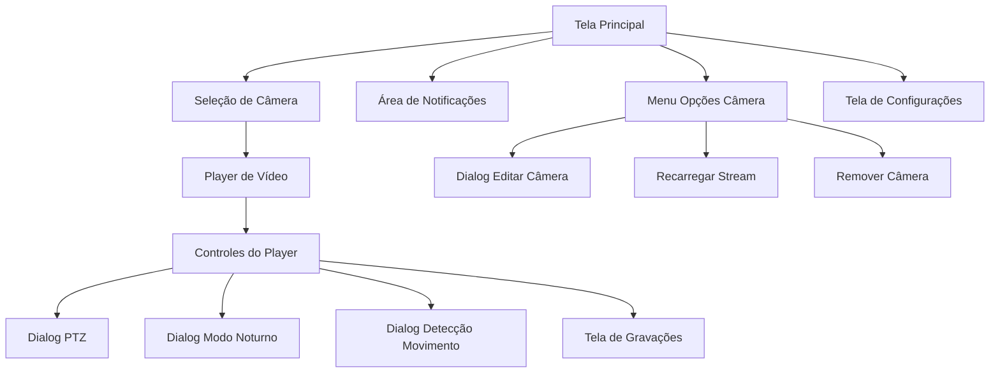

# Documento de Requisitos do Produto - App de Câmeras de Segurança

## 1. Visão Geral do Produto

Aplicativo móvel para monitoramento de câmeras de segurança com controles avançados, sistema de notificações organizadas e reprodução de vídeos gravados. O app permite conexão direta com câmeras IP usando protocolo proprietário identificado, oferecendo controle completo sobre PTZ, detecção de movimento, modo noturno e gravações.

## 2. Funcionalidades Principais

### 2.1 Papéis de Usuário

| Papel          | Método de Registro            | Permissões Principais                                                   |
| -------------- | ----------------------------- | ----------------------------------------------------------------------- |
| Usuário Padrão | Registro local no dispositivo | Visualizar streams, controlar câmeras, receber notificações             |
| Administrador  | Configuração inicial do app   | Adicionar/remover câmeras, configurar notificações, gerenciar gravações |

### 2.2 Módulos de Funcionalidade

Nosso aplicativo de câmeras consiste nas seguintes páginas principais:

1. **Tela Principal**: Lista de câmeras, player de vídeo, controles do player, área de notificações
2. **Tela de Configurações**: Gerenciamento de câmeras, configurações de notificação, preferências do app
3. **Tela de Gravações**: Lista de vídeos gravados, reprodução de gravações, filtros por data/câmera
4. **Dialogs de Controle**: PTZ, modo noturno, detecção de movimento, edição de câmera

### 2.3 Detalhes das Páginas

| Nome da Página               | Nome do Módulo                 | Descrição da Funcionalidade                                                                                       |
| ---------------------------- | ------------------------------ | ----------------------------------------------------------------------------------------------------------------- |
| Tela Principal               | Lista de Câmeras               | Exibir cards de câmeras com preview, status de conexão, indicador de cor por câmera                               |
| Tela Principal               | Player de Vídeo                | Reproduzir stream em tempo real, suporte a múltiplos codecs (H.264, H.265, MJPEG), tratamento de erros de formato |
| Tela Principal               | Controles do Player            | Botões: PTZ, Som, Detecção de Movimento, Modo Noturno, Notificação, Vídeos Gravados (nesta ordem)                 |
| Tela Principal               | Menu de Opções da Câmera       | Ícone de 3 pontos no canto superior esquerdo do card com opções: Remover Câmeras, Editar, Recarregar Stream       |
| Tela Principal               | Área de Notificações           | Lista organizada por câmera com cores distintivas, agrupamento por nome da câmera                                 |
| Dialog PTZ                   | Controle Direcional            | Botões direcionais (8 direções), controle de velocidade (1-10), zoom in/out, botão parar                          |
| Dialog Modo Noturno          | Configurações de Iluminação    | Opções: Auto/Dia/Noite, controle de luz IR, controle de luz visível, limiar de mudança automática                 |
| Dialog Detecção de Movimento | Configurações de Sensibilidade | Ajuste de sensibilidade (1-10), definição de áreas de detecção, ativar/desativar                                  |
| Tela de Gravações            | Lista de Vídeos                | Exibir gravações por data, filtros por câmera, tipos de gravação (contínua, movimento, alarme)                    |
| Tela de Gravações            | Player de Gravação             | Reproduzir vídeos gravados, controles de reprodução (play/pause/seek), informações do arquivo                     |
| Tela de Configurações        | Gerenciamento de Câmeras       | Adicionar nova câmera, editar configurações existentes, testar conexão                                            |
| Tela de Configurações        | Configurações de Notificação   | Ativar/desativar por tipo, sons de alerta, vibração, horários de silêncio                                         |

## 3. Fluxo Principal de Uso

### Fluxo do Usuário Principal:

1. **Visualização**: Usuário abre o app e vê lista de câmeras na tela principal
2. **Seleção**: Toca em uma câmera para visualizar o stream no player
3. **Controle**: Usa botões abaixo do player para controlar funcionalidades (PTZ, som, etc.)
4. **Notificações**: Recebe alertas organizados por câmera na área de notificações
5. **Gravações**: Acessa vídeos gravados através do botão específico
6. **Configuração**: Usa menu de 3 pontos para editar, recarregar ou remover câmeras



## 4. Design da Interface do Usuário

### 4.1 Estilo de Design

* **Cores Primárias**:

  * Fundo: #1E1E1E (cinza escuro)

  * Cards: #2D2D2D (cinza médio)

  * Texto: #FFFFFF (branco)

  * Acentos: Cores personalizáveis por câmera

* **Estilo dos Botões**:

  * Botões circulares com ícones

  * Fundo semi-transparente (#000000 com 70% opacidade)

  * Ícones brancos com sombra

  * Efeito de toque com ripple

* **Tipografia**:

  * Fonte: Roboto (padrão Android) / SF Pro (iOS)

  * Tamanhos: 16sp (títulos), 14sp (texto normal), 12sp (legendas)

* **Layout**:

  * Design baseado em cards

  * Navegação inferior fixa

  * Player de vídeo em proporção 16:9

  * Controles sobrepostos ao player

* **Ícones**:

  * Material Design Icons

  * Tamanho padrão: 24dp

  * Cor: branca com sombra para contraste

### 4.2 Visão Geral do Design das Páginas

| Nome da Página      | Nome do Módulo            | Elementos da UI                                                                                                      |
| ------------------- | ------------------------- | -------------------------------------------------------------------------------------------------------------------- |
| Tela Principal      | Lista de Câmeras          | Cards em grid 2x2, cada card com preview, nome, status, cor identificadora, menu 3 pontos no canto superior esquerdo |
| Tela Principal      | Player de Vídeo           | Container 16:9, overlay com controles, indicador de loading, tratamento de erro com botão retry                      |
| Tela Principal      | Controles do Player       | Barra horizontal com 6 botões circulares: PTZ, Som, Detecção, Modo Noturno, Notificação, Gravações                   |
| Tela Principal      | Área de Notificações      | Lista agrupada por câmera, header com cor da câmera, contador de notificações, timestamp                             |
| Dialog PTZ          | Controle Direcional       | Grid 3x3 com botões direcionais, slider de velocidade, botões zoom, botão central "STOP"                             |
| Dialog Modo Noturno | Opções de Iluminação      | Segmented control (Auto/Dia/Noite), switches para IR e luz visível, slider de limiar                                 |
| Dialog Detecção     | Configuração de Movimento | Slider de sensibilidade, preview da câmera com overlay de áreas, switch ativar/desativar                             |
| Tela de Gravações   | Lista de Vídeos           | Lista com thumbnails, informações (data, duração, tipo), filtros no topo                                             |

### 4.3 Responsividade

* **Orientação**: Suporte a retrato e paisagem

* **Tamanhos de Tela**: Otimizado para smartphones (5" a 7")

* **Densidade**: Suporte a diferentes densidades de pixel (mdpi a xxxhdpi)

* **Interação Touch**: Botões com área mínima de 48dp, gestos de pinch-to-zoom no player

## 5. Especificações Técnicas

### 5.1 Protocolo de Comunicação

* **Porta de Controle**: 34567 (comandos PTZ, configurações)

* **Porta de Stream**: 2223 (vídeo em tempo real)

* **Porta Web**: 8899 (interface de configuração)

* **Autenticação**: MD5 hash com protocolo DVRIP-Web

* **Formato de Comando**: JSON sobre TCP com header binário

### 5.2 Codecs Suportados

* **Primário**: H.264 (AVC)

* **Secundário**: H.265 (HEVC)

* **Fallback**: MJPEG, MPEG-4

* **Resoluções**: 1920x1080, 1280x720, 640x480

* **Taxa de Quadros**: 15fps, 25fps, 30fps

* **Melhorias para o Sistema de Codecs**

  <br />

  # **Melhorias para o Sistema de Codecs**

  <br />

  ## **1. Codecs Mais Modernos e Eficientes**

  <br />

* **Adições Recomendadas**

  ```
  class EnhancedStreamConfiguration {
    static const List<StreamConfig> MODERN_CODECS = [
      // Ultra-modernos (2023+)
      StreamConfig(codec: 'H.266', resolution: '3840x2160', fps: 60),  // VVC
      StreamConfig(codec: 'AV1', resolution: '3840x2160', fps: 30),    // Alta eficiência
      
      // Modernos otimizados
      StreamConfig(codec: 'H.265+', resolution: '2560x1440', fps: 60), // HEVC melhorado
      StreamConfig(codec: 'VP9', resolution: '1920x1080', fps: 60),    // Google
      
      // Codecs atuais melhorados
      StreamConfig(codec: 'H.264+', resolution: '1920x1080', fps: 60), // AVC High Profile
    ];
  }

  ```

* **Benefícios dos Novos Codecs**

  * **H.266 (VVC)**: 50% mais eficiente que H.265
  * **AV1**: Codec aberto, sem royalties, ótima compressão
  * **VP9**: Alternativa gratuita ao H.265
  * **H.265+**: Perfis avançados com melhor qualidade

    <br />
    ## **Resoluções Expandidas e Adaptativas**
    <br />

    **Sistema de Resoluções Inteligentes**

```
// Escolhe resolução próxima ao tamanho da tela
for (final resolution in resolutions) {
  final [width, height] = resolution.split('x').map(int.parse).toList();
  if (width <= screenSize.width * 2 && height <= screenSize.height * 2) {
    return resolution;
  }
}

return resolutions.last; // Fallback para menor resolução
```

<br />

<br />

## **Taxa de Quadros Dinâmica e Inteligente**

**FPS Adaptativo**

```
class DynamicFPSController {
  static const Map<CameraUsage, int> OPTIMAL_FPS = {
    CameraUsage.monitoring: 15,        // Monitoramento básico
    CameraUsage.security: 25,          // Segurança padrão
    CameraUsage.traffic: 30,           // Trânsito/movimento
    CameraUsage.sports: 60,            // Esportes/alta velocidade
    CameraUsage.slowMotion: 120,       // Análise detalhada
  };
  
  // FPS baseado em movimento detectado
  static int calculateAdaptiveFPS({
    required double motionLevel,      // 0.0 - 1.0
    required BatteryLevel battery,
    required NetworkQuality network,
  }) {
    int baseFps = 25;
    
    // Ajuste por movimento
    if (motionLevel > 0.7) baseFps = 60;        // Muito movimento
    else if (motionLevel > 0.3) baseFps = 30;   // Movimento moderado
    else if (motionLevel < 0.1) baseFps = 15;   // Pouco movimento
    
    // Ajuste por bateria (câmeras wireless)
    if (battery == BatteryLevel.low) baseFps = (baseFps * 0.6).round();
    
    // Ajuste por qualidade da rede
    if (network == NetworkQuality.poor) baseFps = (baseFps * 0.5).round();
    
    return baseFps.clamp(5, 120);
  }
}

enum CameraUsage { monitoring, security, traffic, sports, slowMotion }
enum BatteryLevel { high, medium, low, critical }
enum NetworkQuality { excellent, good, fair, poor }

```

<br />

<br />

<br />

## **Perfis de Qualidade Inteligentes**

**Sistema de Perfis Automáticos**

```
class QualityProfileManager {
  static const Map<String, QualityProfile> PROFILES = {
    'ultra': QualityProfile(
      codec: 'H.265',
      resolution: '3840x2160',
      fps: 30,
      bitrate: 15000000,  // 15 Mbps
      quality: 'high',
      useCase: 'Gravação de evidências, zoom digital',
    ),
    
    'security': QualityProfile(
      codec: 'H.264',
      resolution: '1920x1080', 
      fps: 25,
      bitrate: 4000000,   // 4 Mbps
      quality: 'medium-high',
      useCase: 'Monitoramento 24/7, reconhecimento facial',
    ),
    
    'efficiency': QualityProfile(
      codec: 'H.265',
      resolution: '1280x720',
      fps: 15,
      bitrate: 1500000,   // 1.5 Mbps
      quality: 'medium',
      useCase: 'Armazenamento longo prazo, banda limitada',
    ),
    
    'mobile': QualityProfile(
      codec: 'H.264',
      resolution: '640x480',
      fps: 15,
      bitrate: 500000,    // 500 Kbps
      quality: 'low-medium',
      useCase: 'Visualização em celular, 3G/4G',
    ),
  };
  
  static QualityProfile selectProfile({
    required DeviceCapability device,
    required NetworkCondition network,
    required StorageConstraint storage,
    required PowerMode power,
  }) {
    // Lógica de seleção baseada em múltiplos fatores
    if (power == PowerMode.battery && network.bandwidth < 2000000) {
      return PROFILES['mobile']!;
    }
    
    if (storage.availableGB < 10) {
      return PROFILES['efficiency']!;
    }
    
    if (device.supportsHardwareDecoding && network.bandwidth > 10000000) {
      return PROFILES['ultra']!;
    }
    
    return PROFILES['security']!; // Padrão balanceado
  }
}

```

## **Codecs Especializados para Cenários Específicos**

**Codecs por Tipo de Ambiente**

```
class SpecializedCodecs {
  static const Map<EnvironmentType, CodecConfig> ENVIRONMENT_CODECS = {
    // Ambiente com pouca luz - prioriza detalhes nas sombras
    EnvironmentType.lowLight: CodecConfig(
      codec: 'H.265',
      profile: 'Main10',      // 10-bit para melhor gradiente
      preset: 'slow',         // Melhor qualidade
      denoising: true,
    ),
    
    // Movimento rápido - prioriza temporal
    EnvironmentType.highMotion: CodecConfig(
      codec: 'H.264',
      profile: 'High',
      preset: 'fast',         // Baixa latência
      motionEstimation: 'hex', // Algoritmo otimizado
    ),
    
    // Análise forense - máxima qualidade
    EnvironmentType.forensic: CodecConfig(
      codec: 'H.265',
      profile: 'Main444',     // 4:4:4 chroma sampling
      preset: 'veryslow',     // Qualidade máxima
      lossless: true,
    ),
  };
}

enum EnvironmentType { 
  lowLight, highMotion, forensic, weather, traffic, indoor, outdoor 
}

```

### 5.3 Funcionalidades de Controle

#### PTZ (Pan-Tilt-Zoom)

* **Direções**: 8 direções + zoom in/out

* **Velocidade**: 1-10 (configurável)

* **Comandos**: Movimento contínuo com stop manual

* **Presets**: Suporte a posições pré-definidas

#### Detecção de Movimento

* **Sensibilidade**: 1-10 (ajustável)

* **Áreas**: Definição de zonas de detecção

* **Notificações**: Alertas em tempo real

* **Gravação**: Trigger automático para gravação

#### Modo Noturno

* **Modos**: Auto, Dia, Noite

* **Luz IR**: Controle on/off

* **Luz Visível**: Controle on/off (se suportado)

* **Limiar**: Ajuste automático baseado em luminosidade

#### Sistema de Gravação

* **Tipos**: Contínua, por movimento, por alarme, manual

* **Formatos**: MP4, AVI

* **Armazenamento**: Local na câmera ou NVR

* **Busca**: Por data, hora, tipo de evento

### 5.4 Sistema de Notificações

#### Organização por Câmera

* **Agrupamento**: Notificações agrupadas por câmera

* **Identificação Visual**: Cor única por câmera

* **Contador**: Número de notificações não lidas

* **Timestamp**: Data e hora de cada evento

#### Tipos de Notificação

* **Movimento Detectado**: Alerta com snapshot

* **Conexão Perdida**: Aviso de desconexão

* **Conexão Restaurada**: Confirmação de reconexão

* **Erro de Codec**: Problema de formato de vídeo

* **Gravação Iniciada/Parada**: Status de gravação

### 5.5 Tratamento de Erros

#### Erros de Codec

* **Detecção Automática**: Identificação de formato não suportado

* **Fallback**: Tentativa automática com diferentes codecs

* **Interface**: Widget de erro com opção de retry

* **Configuração**: Mudança automática para substream H.264

#### Erros de Conexão

* **Timeout**: 30 segundos para conexão inicial

* **Retry**: Tentativas automáticas com backoff exponencial

* **Notificação**: Alerta ao usuário sobre problemas de rede

* **Reconexão**: Automática quando rede for restaurada

## 6. Critérios de Aceitação

### 6.1 Player de Vídeo

* ✅ Stream deve ser exibido em tempo real com latência < 2 segundos

* ✅ Suporte a múltiplos codecs com fallback automático

* ✅ Tratamento de erro com interface amigável

* ✅ Controles sobrepostos sem alterar tamanho do card

### 6.2 Controles do Player

* ✅ 6 botões na ordem especificada: PTZ, Som, Detecção, Modo Noturno, Notificação, Gravações

* ✅ Botões funcionais apenas se câmera suportar a funcionalidade

* ✅ Feedback visual do estado atual (ativo/inativo)

* ✅ Dialogs específicos para cada controle

### 6.3 Menu de Opções da Câmera

* ✅ Ícone de 3 pontos no canto superior esquerdo do card

* ✅ 3 opções: Remover Câmeras, Editar, Recarregar Stream

* ✅ Confirmação para ação de remoção

* ✅ Edição inline das configurações da câmera

### 6.4 Sistema de Notificações

* ✅ Agrupamento por câmera com cores distintivas

* ✅ Organização por nome da câmera

* ✅ Contador de notificações não lidas

* ✅ Timestamp de cada notificação

* ✅ Diferentes tipos de alerta com ícones apropriados

### 6.5 Funcionalidades Avançadas

* ✅ Controle PTZ com 8 direções + zoom

* ✅ Modo noturno com opções IR e luz visível

* ✅ Detecção de movimento configurável

* ✅ Acesso a gravações com filtros

* ✅ Controle de áudio (mute/unmute)

## 7. Casos de Uso Detalhados

### 7.1 Caso de Uso: Visualizar Stream da Câmera

**Ator**: Usuário
**Pré-condições**: Câmera adicionada e conectada
**Fluxo Principal**:

1. Usuário abre o app
2. Visualiza lista de câmeras na tela principal
3. Toca no card de uma câmera
4. Stream é carregado no player
5. Controles aparecem abaixo do player

**Fluxos Alternativos**:

* 4a. Erro de codec: Sistema tenta fallback automático

* 4b. Erro de conexão: Exibe mensagem de erro com retry

### 7.2 Caso de Uso: Controlar PTZ da Câmera

**Ator**: Usuário
**Pré-condições**: Câmera selecionada e suporta PTZ
**Fluxo Principal**:

1. Usuário toca no botão PTZ
2. Dialog de controle PTZ é exibido
3. Usuário seleciona direção e velocidade
4. Comando é enviado para a câmera
5. Câmera executa movimento
6. Usuário toca "STOP" para parar

### 7.3 Caso de Uso: Configurar Modo Noturno

**Ator**: Usuário
**Pré-condições**: Câmera selecionada e suporta modo noturno
**Fluxo Principal**:

1. Usuário toca no botão Modo Noturno
2. Dialog de configuração é exibido
3. Usuário seleciona modo (Auto/Dia/Noite)
4. Configura luzes IR e visível se necessário
5. Ajusta limiar para modo automático
6. Configurações são aplicadas à câmera

### 7.4 Caso de Uso: Gerenciar Câmera via Menu

**Ator**: Usuário
**Pré-condições**: Câmera adicionada ao sistema
**Fluxo Principal**:

1. Usuário toca no ícone de 3 pontos do card
2. Menu de opções é exibido
3. Usuário seleciona uma opção:

   * Editar: Abre dialog de edição

   * Recarregar: Reconecta o stream

   * Remover: Solicita confirmação e remove

### 7.5 Caso de Uso: Visualizar Notificações

**Ator**: Usuário
**Pré-condições**: Notificações recebidas de câmeras
**Fluxo Principal**:

1. Usuário visualiza área de notificações
2. Notificações são agrupadas por câmera
3. Cada grupo tem cor distintiva da câmera
4. Usuário pode tocar para ver detalhes
5. Notificações são marcadas como lidas

## 8. Métricas de Sucesso

### 8.1 Performance

* **Latência de Stream**: < 2 segundos

* **Tempo de Conexão**: < 5 segundos

* **Taxa de Sucesso de Conexão**: > 95%

* **Tempo de Resposta PTZ**: < 1 segundo

### 8.2 Usabilidade

* **Facilidade de Adição de Câmera**: < 3 minutos

* **Acesso a Controles**: Máximo 2 toques

* **Identificação de Notificações**: Imediata por cor

* **Recuperação de Erro**: Automática em 90% dos casos

### 8.3 Confiabilidade

* **Uptime do App**: > 99%

* **Recuperação de Conexão**: Automática

* **Perda de Dados**: 0% (notificações e configurações)

* **Crashes**: < 0.1% das sessões

Este documento serve como guia completo para implementação de todas as funcionalidades solicitadas, garantindo uma experiência de usuário consistente e profissional.
